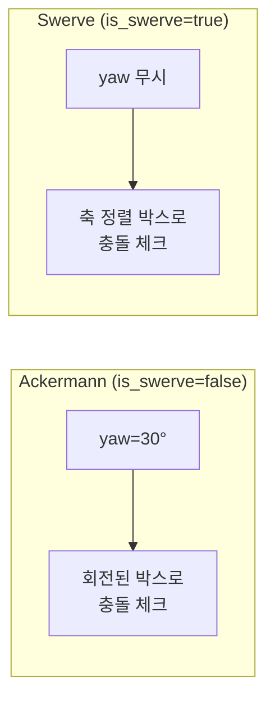
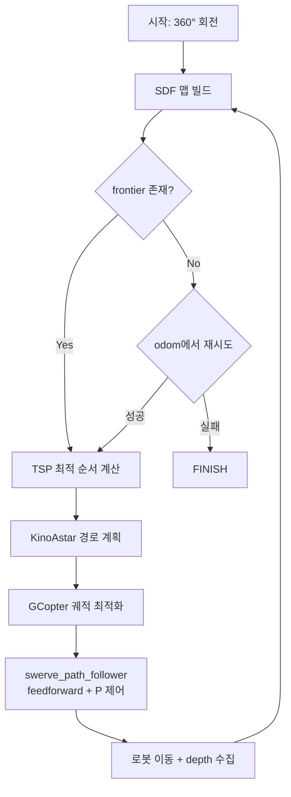

# Step 10: ApexNAV 자율 주행

> **ApexNAV C++ 코드 (IsaacSim swerve 전용 branch)**:
> [romaster93/ApexNav_ROS2_wrapper `isaacsim-ffw-swerve`](https://github.com/romaster93/ApexNav_ROS2_wrapper/tree/isaacsim-ffw-swerve)
>
> 이 가이드의 모든 C++ 수정사항 (KinoAstar swerve 모드, map_ros free_ray 분리, FSM odom_far 임계값 등)은 위 branch에 있습니다.
> 원본 ApexNAV 코드는 `main` branch에 보존되어 있습니다.

## 이 Step에서 다루는 것

| 섹션 | 내용 |
|------|------|
| **[5] 실행** | 터미널별 실행 순서 (Phase A/C), 공통 환경 설정, RViz 확인 |
| **[6] 설정 파일 설명** | `planning_param_ffw.yaml`, `algorithm_traj.launch.py`, `config/apexnav_bridge.yaml` |
| **환경 프로파일** | 가정집 / 공장 (factory) 파라미터 비교 |
| **Swerve 로봇용 패치** | Step 0/0b/1/1b/2/3a/3b/4a/4b/5 — `isaacsim-ffw-swerve` branch에 반영된 수정 내역 |
| **전체 시스템 데이터 흐름** | 실행 파이프라인, 탐색 루프, 토픽 흐름도, `v_max` 일관성 체크리스트, [파라미터 튜닝 가이드](#파라미터-튜닝-가이드) |
| **[7] Troubleshooting** | 흔한 증상별 원인/해결 (과거 이슈는 "제거됨 — 역사적 맥락" 박스로 표시) |

> [1] 개요, [2] 사전 요구사항, [3] 빌드, [4] 파일 구조는 이 Step에서는 다루지 않습니다. 각각 Step 8 ([ApexNAV 개요](08-apexnav-overview.md)) 및 Step 9 ([ApexNAV Bridge](09-apexnav-bridge.md))를 참조하세요.

---

## [5] 실행

### 5.1 전체 실행 순서

터미널이 많으므로 **단계별로 나누어** 실행합니다. 각 단계가 동작하는지 확인한 후 다음 단계로 넘어가세요.

> 💡 **모든 ROS2 터미널 공통 전제**
> - 아래 명령어들은 `conda deactivate && source ~/ms_AIworker/scripts/ros2-bridge-env.sh` 이후 실행하는 것을 전제로 합니다 (터미널마다 매번 필요).
> - **예외**: 터미널 1 (IsaacSim) 만 `conda activate isaac_sim` 을 사용합니다.
> - C++ 플래너 계열(터미널 9, 13) 은 추가로 `source ~/ApexNav_ROS2_wrapper/install/setup.bash` 가 필요합니다 (trajectory_manager msg 사용).

**Phase A -- 기본 인프라 (IsaacSim + 로봇 제어)**

| 터미널 | 내용 |
|--------|------|
| **1** | IsaacSim 실행 후 Play 버튼 클릭 |
| **2** | Swerve Controller |
| **3** | Nav2 Bridge (TF) |
| **4** | ApexNAV Bridge |

각 터미널에서 아래 명령어를 복붙하세요:

**터미널 1 (IsaacSim)**:
```bash
conda activate isaac_sim && isaacsim
```
> IsaacSim이 열리면 씬을 열고 **Play** 버튼을 누르세요.

**터미널 2 (Swerve Controller)**:
```bash
conda deactivate && source ~/ms_AIworker/scripts/ros2-bridge-env.sh && python3 ~/ms_AIworker/scripts/swerve_controller.py
```

**터미널 3 (Nav2 Bridge)**:
```bash
conda deactivate && source ~/ms_AIworker/scripts/ros2-bridge-env.sh && python3 ~/ms_AIworker/scripts/nav2_bridge.py
```

**터미널 4 (ApexNAV Bridge)**:
```bash
conda deactivate && source ~/ms_AIworker/scripts/ros2-bridge-env.sh && python3 ~/ms_AIworker/scripts/isaacsim_apexnav_bridge.py --ros-args --params-file ~/ms_AIworker/config/apexnav_bridge.yaml
```

> **확인**: `ros2 topic list | grep habitat` -> `/habitat/odom`, `/habitat/camera_rgb` 등이 보여야 합니다.

**Phase B -- VLM 서버 (생략 가능)**

> Phase B는 [Step 11: ApexNAV VLM 통합](11-apexnav-vlm.md)에서 실행합니다. 여기서는 VLM 없이 기하학적 frontier 탐색만 수행합니다.
>
> ⚠️ **터미널 번호 규칙**: Phase B 를 생략하면 터미널 **5-8, 10 은 비워두고** Phase C 로 바로 진행합니다 (11, 12, 9, 13 순). 터미널 번호 5-8, 10 은 Step 11 과의 일관성을 위해 예약해 둔 것이며, VLM 없이 돌릴 때는 존재하지 않아도 됩니다.

**Phase C -- ApexNAV 플래너 실행** (Step 11의 Phase C와 다름)

> ⚠️ **Phase C 용어 주의**
> - 이 Step(10)의 **"Phase C"** 는 **C++ 플래너 실행** (터미널 9, 11, 12, 13)을 의미합니다.
> - Step 11([VLM 통합](11-apexnav-vlm.md))의 **"Phase C"** 는 **VLM 노드 실행**으로 다른 의미입니다.
> - VLM을 통합할 때는 이 Phase C (C++ 플래너) + Step 11의 Phase C (VLM 노드)를 **둘 다** 실행해야 합니다.

> **순서 주의**: `target_label_publisher.py`를 **먼저** 실행한 후 C++ 플래너를 실행하세요.
> 플래너가 먼저 뜨면 `/detector/confidence_threshold`가 없어서 `[Real] No odom || No target confidence threshold` 경고가 반복됩니다.

| 터미널 | 내용 |
|--------|------|
| **11** | RViz |
| **12** | 물체 명령 **(먼저 실행!)** |
| **9** | C++ 플래너 |
| **13** | Swerve Path Follower (traj_server 대체) |

각 터미널에서 아래 명령어를 복붙하세요:

**터미널 11 (RViz)**:
```bash
conda deactivate && source ~/ms_AIworker/scripts/ros2-bridge-env.sh && rviz2 -d ~/ms_AIworker/config/apexnav_rviz.rviz --ros-args -p use_sim_time:=true
```

**터미널 12 (물체 명령 — 먼저 실행!)**:
```bash
conda deactivate && source ~/ms_AIworker/scripts/ros2-bridge-env.sh && python3 ~/ms_AIworker/scripts/target_label_publisher.py
```

**터미널 9 (C++ 플래너)**:
```bash
conda deactivate && source ~/ms_AIworker/scripts/ros2-bridge-env.sh && source ~/ApexNav_ROS2_wrapper/install/setup.bash && ros2 launch exploration_manager exploration_traj.launch.py 2>&1 | tee /tmp/apexnav_run.log
```

**터미널 13 (Swerve Path Follower)**:
```bash
conda deactivate && source ~/ms_AIworker/scripts/ros2-bridge-env.sh && source ~/ApexNav_ROS2_wrapper/install/setup.bash && python3 ~/ms_AIworker/scripts/swerve_path_follower.py
```

> **터미널 13 (swerve_path_follower)**: ApexNAV의 기본 `traj_server`는 unicycle MPC 라서 FFW-SG2 swerve의 vy를 활용 못 합니다. `exploration_traj.launch.py`에서 `traj_server`는 비활성화돼 있으며, 대신 이 노드가 `/planning/trajectory`(PolyTraj septic)를 직접 평가해 lookahead 0.25s pure-pursuit로 holonomic `/cmd_vel` 을 발행합니다. 진행 방향으로 로봇을 회전시켜(`angular.z`) depth 카메라가 항상 전방을 보도록 합니다. `trajectory_manager` msg가 필요하므로 `ApexNAV_ROS2_wrapper/install/setup.bash`를 source 하세요.

> **확인**: 터미널 9에서 `Exploration FSM initialized` 메시지가 나오면 준비 완료.

> **VLM 통합** (Phase B + VLM 노드)은 [Step 11: ApexNAV VLM 통합](11-apexnav-vlm.md)에서 다룹니다.

### 5.2 C++ 플래너 로그 확인

터미널 9(C++ 플래너)는 5.1 에서 이미 실행했습니다. 정상 시작되었는지 로그로 확인합니다:

- `[exploration_node]`, `[tsp_solver]` 노드 기동
- `Starting in REAL WORLD mode` + `Initialization complete` 메시지
- `traj_server`는 2026-04-07부터 launch에서 비활성화됨 — `swerve_path_follower.py`(터미널 13)가 대체

```bash
# 로그 파일로 다시 확인 (터미널 9의 2>&1 | tee /tmp/apexnav_run.log 참고)
tail -n 30 /tmp/apexnav_run.log
```

### 5.3 물체 탐색 옵션 상세

터미널 12의 `target_label_publisher.py`는 **시작 시 자동 360도 회전**으로 초기 SDF 맵을 빌드하고, 이후 대화형 프롬프트(`target>`)로 탐색 라벨을 받습니다.

> **왜 회전하는가?** real_world 궤적 모드에서는 Habitat의 이산 초기 회전이 없습니다.
> 정면만 보이는 상태에서 frontier를 찾을 수 없어 `open set empty, no path` 에러가 발생합니다.

**실행 모드**:

| 모드 | 명령 | 용도 |
|------|------|------|
| 대화형 (기본) | `python3 ~/ms_AIworker/scripts/target_label_publisher.py` | 360° 회전 후 `target>` 프롬프트로 라벨 입력 |
| 직접 지정 | `python3 ~/ms_AIworker/scripts/target_label_publisher.py chair` | 회전 후 `chair` 라벨 자동 발행 |
| 회전 건너뛰기 | `python3 ~/ms_AIworker/scripts/target_label_publisher.py --no-rotate` | 이미 SDF 맵이 빌드된 상태에서 라벨만 다시 보낼 때 |

발행되는 토픽:
- `/detector/confidence_threshold` (1Hz, 지속) — FSM이 이 토픽이 살아있어야 진행함
- `/detector/label` — 탐색할 객체 라벨 (string)
- `/move_base_simple/goal` — FSM 트리거 (TRANSIENT_LOCAL durability)

회전 완료 로그: `[Init] Rotation complete (360 degrees). SDF map ready.`

### 5.4 RViz에서 확인

RViz Fixed Frame을 **`World`** (대문자 W)로 설정한 후, 다음 토픽을 추가합니다:

**맵 시각화 (PointCloud2)**:
- `/grid_map/occupied` -- 장애물 (빨강)
- `/grid_map/free` -- 자유 공간 (초록)
- `/grid_map/occupied_inflate` -- inflation 영역
- `/grid_map/depth_cloud` -- depth 투영 포인트
- `/grid_map/unknown` -- 미탐사 영역

**경로/궤적 시각화 (Marker/Path)**:
- `/kinoastar/FlatPath` (MarkerArray) -- A* 탐색 경로
- `/kinoastar/FlatTraj` (Path) -- 평탄화된 궤적
- `/trajectory/mincoPath` (Path) -- 최종 최적화 경로
- `/planning_vis/trajectory` (Marker) -- 궤적 시각화
- `/planning_vis/frontier` (Marker) -- frontier 시각화

**카메라 (Image)**:
- `/habitat/camera_rgb` -- RGB 이미지
- `/habitat/camera_depth` -- 정규화된 depth

### 5.5 탐색 과정

IsaacSim은 궤적 모드(`is_real_world=true`)를 사용합니다. FSM 상태:

```
1. [INIT]          FSM 초기화, /detector/confidence_threshold 수신 대기
2. [WAIT_TRIGGER]  /move_base_simple/goal 수신 대기
3. [PLAN_TRAJ]     SDF 맵 빌드, frontier 탐색, 연속 궤적 계획
4. [EXEC_TRAJ]     swerve_path_follower가 PolyTraj 평가 → holonomic /cmd_vel (vx, vy)
5. [REPLAN]        실행 중 새 정보 반영하여 궤적 재계획
6. [반복]          3-5를 반복하며 환경 탐색
7. [FINISH]        물체 발견 + 접근 완료 → 정지
```

> **참고**: Habitat 시뮬레이터 모드(`is_real_world=false`)에서는 이산 액션(FORWARD 0.25m, LEFT 30도)을
> 사용하지만, IsaacSim에서는 연속 궤적 기반 제어를 사용합니다.

---

## [6] 설정 파일 설명

### planning_param_ffw.yaml (로봇 물리 파라미터)

| 파라미터 | 값 | 설명 |
|---------|-----|------|
| `length` | 0.56 | 로봇 전후 길이 (m) |
| `width` | 0.51 | 로봇 좌우 폭 (m) |
| `wheel_base` | 0.43 | 축간 거리 (m) |
| `safe_dist` | 0.45 | 안전 거리 (m) |
| `max_vel` | 0.35 | 최대 속도 (m/s). 시뮬 상한 0.3 m/s 대비 catch-up 여유 확보를 위해 0.35. 내부 `max_vel_ = 0.35×0.6 = 0.21 m/s` |
| `max_acc` | 2.0 | 최대 가속도 (m/s^2) |

> 이 값들은 FFW-SG2의 실제 바퀴 위치(`swerve_controller.py`)에서 계산되었습니다.
>
> 📌 **언제 어느 값을 올리고 내리는지**는 [파라미터 튜닝 가이드](#파라미터-튜닝-가이드)와 [v_max 일관성 체크리스트](#v_max-일관성-체크리스트)를 참고하세요.

### algorithm_traj.launch.py (플래너 파라미터)

`exploration_traj.launch.py`가 내부적으로 `algorithm_traj.launch.py`를 호출합니다.
주요 파라미터는 `algorithm_traj.launch.py`에 있습니다:

| 파라미터 | 값 | 설명 |
|---------|-----|------|
| `map_size_x/y` | 80.0 | SDF 맵 크기 (m) |
| `obstacles_inflation` | 0.45 | 장애물 팽창 반경 (m) -- 로봇 반경 |
| `depth_filter_maxdist` | MAX_DEPTH - 0.01 | depth 최대 거리 (m). `config/apexnav_bridge.yaml`의 `max_depth`에서 자동 계산 |
| `local_bound` | 10.0 | ESDF (Euclidean Signed Distance Field) 업데이트 범위 (m). depth 센서 최대 거리와 독립적으로 고정 |
| `perception_utils.max_dist` | 4.0 | perception 라이브러리가 사용하는 최대 거리 (m). depth 범위와 별도로 관리 |
| `free_ray_extrapolation` | 0.95 | depth가 최대 거리를 초과할 때 자유 공간으로 표시하는 거리 배수. 0.95 = max_dist의 95% = 약 4.74m까지 자유 공간으로 마킹 |
| `is_real_world` | true | 궤적 모드 사용 (이산 액션 대신 연속 속도) |
| `cx, cy` | 320, 240 | 카메라 주점 (640x480 기준) |
| `fx, fy` | 245.33, 245.33 | 카메라 초점 거리 (`/zed_mini/camera_info` K 행렬에서 확인) |
| `frame_id` | World | 맵 좌표 프레임 (IsaacSim stage root, 고정) |
| `sensor_pose_topic` | /habitat/camera_pose | 실제 카메라 pose (map_ros depth 투영용). 이름이 `sensor_pose`이지만 `/habitat/sensor_pose`(VLM용)와 다름! |
| `planning_param` | planning_param_ffw.yaml | FFW-SG2 로봇 크기 파라미터 |
| `replan_time` | 1.0 | 궤적 재계획 주기 (초). 낮을수록 새로운 정보에 빠르게 대응 |
| `replan_traj_end_threshold` | 1.5 | 궤적 끝에 도달한 것으로 판단하는 거리 (m). 1.5m 이내면 다음 궤적 계획 시작 |
| `odom_far_threshold` | 1.5 | Odometry 신뢰도 체크 임계값 (m). 최후 예상 위치에서 1.5m 초과 벗어나면 위치 재추정 필요 |
| `min_contain_unknown` | 30 | frontier 셀 최소 개수. 30개 미만 미지 영역은 frontier로 인정하지 않음 |

### config/apexnav_bridge.yaml (브릿지 설정)

**용도**: bridge 노드와 C++ 플래너가 공유하는 설정 파일입니다. 이전에는 bridge 코드 내에 하드코딩되어 있었으나, yaml로 통합하여 `--ros-args --params-file` 옵션으로 런타임에 로드할 수 있고, launch 파일도 같은 yaml을 직접 파싱해 C++ 플래너에 값을 전파합니다.

```yaml
# config/apexnav_bridge.yaml (실제 파일 구조)
isaacsim_apexnav_bridge:        # ROS2 노드명 (rclpy Node name과 일치해야 함)
  ros__parameters:
    # depth 정규화 최대 거리 (meters)
    # - bridge: meters / max_depth → [0, 1] 정규화
    # - C++ depth_filter_maxdist도 같이 변경해야 함
    #   (algorithm_traj.launch.py:85, max_depth - 0.01)
    # 작을수록 가까운 것만 보여서 탐색이 길어짐
    max_depth: 5.0

    # Habitat 가상 카메라 높이 (VLM pipeline round-trip용, 실제 카메라 높이 아님)
    camera_height_habitat: 0.88
```

**주요 설정값 설명**:

| 설정 | 기본값 | 설명 |
|------|--------|------|
| `max_depth` | 5.0 | depth 센서 최대 거리 (m). ZED Mini는 약 5m까지 신뢰 가능. 이 값 초과 depth는 1.0으로 정규화되어 C++에서 max-range로 해석됨. launch 파일이 이 값을 읽어 `depth_filter_maxdist = max_depth - 0.01`로 C++에 전파 |
| `camera_height_habitat` | 0.88 | Habitat 가상 카메라 높이 (m). VLM pipeline round-trip용이며 실제 카메라 높이(1.58m)가 아닙니다. `/habitat/sensor_pose` 계산에 사용 |

> 주의: `depth_frame_id`, `rgb_frame_id`, `odom_topic`, `tf_timeout` 같은 필드는 현재 yaml에 없습니다. 해당 값은 bridge 코드 내 상수 또는 ROS2 QoS/TF 기본값을 사용합니다.

**실행 방법**:

```bash
# yaml 파일과 함께 bridge 실행
python3 ~/ms_AIworker/scripts/isaacsim_apexnav_bridge.py \
  --ros-args --params-file ~/ms_AIworker/config/apexnav_bridge.yaml

# 또는 명령행 오버라이드 (yaml보다 우선)
python3 ~/ms_AIworker/scripts/isaacsim_apexnav_bridge.py \
  --ros-args \
  --params-file ~/ms_AIworker/config/apexnav_bridge.yaml \
  -p max_depth:=4.5
```

> `-p` 옵션에는 **파라미터명만** (네임스페이스 없이) 사용합니다. `isaacsim_apexnav_bridge:` / `ros__parameters:`는 yaml 구조이지 CLI 네임스페이스가 아닙니다. `-p bridge.max_depth:=...` 같은 표기는 동작하지 않습니다.

**C++ 플래너와의 연동**:

`algorithm_traj.launch.py`는 `get_parameter()`가 아니라 **yaml을 직접 파싱**해서 `max_depth`를 읽고, 그 값을 C++ map_ros 파라미터들로 전파합니다:

```python
# algorithm_traj.launch.py (실제 코드, line 17-22 근처)
# Read shared max_depth from bridge config (single source of truth)
import yaml
with open(bridge_cfg_path) as f:
    _cfg = yaml.safe_load(f)
MAX_DEPTH = float(_cfg['isaacsim_apexnav_bridge']['ros__parameters']['max_depth'])

# 이후 C++ 노드 파라미터로 전달 (line 75 근처)
# 'map_ros/depth_filter_maxdist': MAX_DEPTH - 0.01
```

이렇게 하면 bridge(Python)와 C++ 플래너가 **같은 yaml을 single source of truth**로 사용하여, depth 범위 불일치로 인한 버그를 방지합니다. yaml의 `max_depth`만 고치면 양쪽이 자동으로 반영됩니다.

---

## 환경 프로파일 (Environment Profiles)

ApexNAV는 환경에 따라 다른 파라미터 프로파일이 필요합니다. 기본 설정은 가정집/실내 환경에 최적화되어 있으며, 공장/창고 같은 대규모 환경에는 별도 프로파일을 사용합니다.

### 사용법

```bash
# 가정집 환경 (기본)
ros2 launch exploration_manager exploration_traj.launch.py

# 공장/창고 환경
ros2 launch exploration_manager exploration_traj_factory.launch.py
```

### 파라미터 비교

| 파라미터 | 가정집 (기본) | 공장/창고 | 이유 |
|---------|-------------|----------|------|
| `map_size` | 80×80m | 200×200m | 넓은 공간 커버 |
| `resolution` | 0.05m | 0.15m | 메모리 절약 (25M cells) |
| `local_bound` | 10m | 25m | ESDF 업데이트 범위 확대 |
| `obstacles_inflation` | 0.45m | 0.50m | 거친 resolution 보정 |
| `perception max_dist` | 4.0m | 4.8m | depth 5m 최대 활용 |
| `frontier cluster_min` | 5 | 3 | 거친 resolution에서 작은 클러스터 감지 |
| `frontier cluster_size` | 0.65m | 1.5m | 넓은 프론티어 병합 |
| `min_contain_unknown` | 30 | 8 | resolution 비례 축소 |
| `astar resolution` | 0.1m | 0.4m | 장거리 탐색 속도 |
| `step_arc` | 0.2m | 0.5m | KinoAstar 탐색 효율 |
| `max_search_time` | 2.0s | 5.0s | 장거리 경로 계획 여유 |
| `free_ray_extrapolation` | 0.95 | 1.5 | 열린 공간 빠른 매핑 |
| `local_target_distance` | 4.0m | 10.0m | 긴 trajectory 계획 |

> **`free_ray_extrapolation` 설명**: depth가 최대 거리(`depth_filter_maxdist * 0.96`)를 초과할 때 free 공간으로 표시하는 거리 배수입니다.
> - 가정집(0.95): 최대 거리의 95% → 약 4.74m까지 free 마킹
> - 공장(1.5): 최대 거리의 150% → 약 7.5m까지 free 마킹 (넓은 통로에서 효과적)

### 주의사항

> **공장 → 가정집 복귀 시**: 반드시 기본 launch 파일(`exploration_traj.launch.py`)로 변경하여 실행하세요.

- 공장 모드의 `resolution 0.15m`는 좁은 문(0.8m) 통과가 어려울 수 있음
- `free_ray_extrapolation=1.5`는 벽이 많은 환경에서 벽 뒤 유령 free 공간 생성 위험

---

## Swerve 로봇용 패치 (2026-04-07 ~ 2026-04-16)

World2 개방 환경에서 자율 주행이 조기에 `No passable frontier` 종료되던 문제를 해결하고, trajectory 추적 안정성을 개선하기 위해 다음 패치들을 적용했습니다.

> ⚠️ **중요: 아래 모든 Step 은 [`isaacsim-ffw-swerve` branch](https://github.com/romaster93/ApexNav_ROS2_wrapper/tree/isaacsim-ffw-swerve) 에 이미 반영되어 있습니다.** 이 branch 를 체크아웃 + 빌드하면 됩니다. 아래 설명은 **재적용을 위한 절차가 아니라, 변경 내역과 역사적 맥락을 기록한 참고 자료**입니다.

**Step 번호 체계 및 의도 요약**:

| Step | 날짜 | 레이어 | 의도 |
|------|------|--------|------|
| **Step 0** | 2026-04-09 | Python (`swerve_path_follower.py`) | feedforward+P, yaw tracking, sim-time 통일 등 path follower 최초 개선 |
| **Step 0b** | 2026-04-16 | Python + C++ FSM | 거리 기반 closest-point follower 도입 + `exploration_fsm_traj.cpp:599-610` odom-far safety check 블록 제거 |
| **Step 1** | 2026-04-07 | Python bridge | 카메라 pose NaN 가드 (`isaacsim_apexnav_bridge.py`) |
| **Step 1b** | 2026-04-09 | Python (`target_label_publisher.py`) | TF 기반 360° 회전, `/detector/confidence_threshold` 지속 발행 |
| **Step 2** | 2026-04-07 | YAML | `planning_param_ffw.yaml` footprint 실측값 (0.56×0.51) 복원 |
| **Step 3a** | 2026-04-07 | Launch | `map_ros/filter_min_height` 0.05→0.5 (가짜 바닥 occupancy 방지) |
| **Step 3b** | 2026-04-07 | Launch | `sdf_map.obstacles_inflation` 0.1→0.45 (footprint 기반 inflation 복원) |
| **Step 4a** | 2026-04-07 | C++ | `kino_astar.cpp::checkCollision` SDFMap2D enum 방어적 주석 (동작 변경 없음) |
| **Step 4b** | 2026-04-07 | C++ | `kino_astar.cpp::isCollisionPosYaw` swerve 분기 추가 (holonomic footprint) |
| **Step 5** | 2026-04-09 | Launch + YAML | `algorithm_traj.launch.py` 파라미터 최적화 (`max_vel=0.35`, `local_bound=10`, etc.) |

의존성: Step 1/1b → Step 0/0b (Python follower가 동작하려면 bridge/label publisher가 먼저), Step 2/3a/3b → Step 4b (map inflation과 footprint collision 설정이 정합되어야 swerve planner가 올바르게 동작), Step 4a/4b/5 는 독립적이지만 cumulative 하게 적용되었습니다.

### Step 0: swerve_path_follower.py 대폭 개선 (2026-04-09)

**파일**: `scripts/swerve_path_follower.py`

#### 0.1 Odometry 소스 변경: `/odom` → `/habitat/odom`

**변경 사항**: odometry 구독을 `/habitat/odom`으로 변경 (World 고정 좌표 사용)

- **이전**: `/odom` (nav2_bridge 발행, 문제: sim time / wall time 혼합, 노이즈)
- **이후**: `/habitat/odom` (IsaacSim 센서에서 직접 발행, 신뢰성 높음)
- **왜**: `/odom`은 IsaacSim Play 타임스탬프와 wall clock이 섞여 있어 TF lookup과 불일치

**확인 방법**:
```bash
ros2 topic echo /habitat/odom | head -20
# header.stamp.sec/nsec 값이 simulation time과 일치해야 함
```

#### 0.2 Feedforward + P 제어 추가

**알고리즘**: trajectory에서 선속도(vx, vy) 직접 계산 + 위치 P 제어

```
feedforward_vel = d/dt(trajectory_polynomial)  # 다항식 미분으로 속도 계산
error_vel = K_p * (desired_pos - current_pos)  # 위치 오차 피드백
final_vel = feedforward_vel + error_vel        # 합산
```

**효과**:
- 이전: lookahead pure pursuit만 사용 → trajectory가 가파를 때 추적 지연
- 이후: feedforward로 속도를 미리 계산 → 부드러운 추적 + 더 빠른 응답

**파라미터** (코드 내, `swerve_path_follower.py`):
- `kp_xy`: 위치 피드백 게인 (단일 스칼라, 기본 2.5; x/y 공통). `self.kp_xy = 2.5` 한 줄로 정의됨
- `_eval_vel(t_rel)`: piece-wise septic 다항식을 inline으로 미분해 `ff_vel`(feedforward 속도)을 계산하는 메서드. 별도의 `trajectory.differentiate()` 호출은 없음

관련 제어식 (코드 line 294-295 근처):
```python
vx = ff_vx + self.kp_xy * vx_b   # ff는 _eval_vel, 오차는 world→body 변환한 vx_b/vy_b
vy = ff_vy + self.kp_xy * vy_b
```

#### 0.3 Yaw Tracking (방향 제어)

**목표**: depth 카메라가 항상 로봇의 진행 방향을 보도록 회전

```
desired_yaw = atan2(vy_desired, vx_desired)
yaw_error = desired_yaw - current_yaw
if |yaw_error| > 80°:
    제자리 회전 (vx=0, vy=0, angular_z=sign(yaw_error) * max_angular_vel)
else:
    회전하며 이동 (angular.z = K_angular * yaw_error)
```

**임계값 설명**:
- 80° 이상 차이 = 거의 역방향이므로 먼저 회전
- 80° 미만 = 회전하며 동시에 이동 (더 빠름)

**왜 필요한가**?
- ApexNAV의 depth 프로세싱이 forward-looking 카메라를 가정
- 카메라가 옆을 보면 frontier 감지 성능 저하

#### 0.4 Trajectory 전환 부드러움 처리

**변경**: trajectory 체인지 포인트에서의 끊김 제거

- **이전**: 새 trajectory 수신 시 즉시 시작 → 속도 급변 가능
- **이후**: 이전 trajectory의 끝 상태(위치, 속도)에서 매끄럽게 연결

**구현**:
```python
if new_trajectory_received:
    # 이전 궤적의 마지막 시점 상태 읽음
    prev_state = old_trajectory.evaluate(old_traj_duration)
    # 새 궤적과 매끄럽게 연결 (위치/속도 일치)
    blend_trajectory(prev_state, new_trajectory)
```

#### 0.5 정지 조건 강화

**정지 판정 (trajectory 끝 도달, `_tick()` line 270 근처)**:
```python
# swerve_path_follower.py
if (t_closest > self.traj_duration - 0.05 and age > self.stale_traj_timeout) \
   or age > 5.0:
    self._publish_zero()
    return
```

- 조건 1: `t_closest`가 trajectory 끝에서 0.05s 이내 **AND** 마지막 traj 수신 후 `stale_traj_timeout`(0.5s) 초과
- 조건 2: 마지막 traj 수신 후 5.0s 초과 (crash 방어)

**왜 필요한가**?
- `traj_server` crash 시 무한 대기를 방지
- `/planning/trajectory` topic이 끊어진 것을 감지
- trajectory **실행 중**에는 stale check를 발동하지 않음 (`t_closest`가 끝 근처일 때만) → 중간에 로봇이 멈추는 문제 제거

**동작**: 위 조건에 걸리면 `_publish_zero()`가 `cmd_vel=0`을 조용히 발행합니다. 별도의 STOP 로그 메시지는 없습니다 (zero-cmd만으로 모터가 정지).

#### 0.6 Sim Time / Wall Time 문제 해결

**변경**: 모든 타임스탬프를 wall clock 기준으로 통일 (rclpy 기반)

- **이전**: IsaacSim `sim_time` + `/odom` `wall_time` 혼합 → TF lookup 오류
- **이후**: 항상 rclpy의 `self.get_clock().now()` (노드의 wall clock) 사용 — 예: `self.traj_recv_wall = self.get_clock().now()`

**효과**:
```
TF lookup error: "time_source mismatch [1 != 2]" → 해결됨
```

#### 검증 결과 (2026-04-09)

| 항목 | 결과 |
|------|------|
| Trajectory 추적 | 20+ 회 연속 완료 |
| Feedforward + P 제어 | 안정적 수렴 (Kp=0.5) |
| Yaw tracking | depth 카메라 항상 전방 유지 |
| Trajectory 전환 | 끊김 없음 |
| 정지 안정성 | crash 감지 성공 |

---

### Step 0b: 거리 기반 Path Follower + safety check 완화 (2026-04-16)

**문제**: 시뮬 속도 한계(0.3 m/s)로 로봇이 trajectory를 못 따라잡으면, trajectory 시간 평가 위치(`traj.getPos(t_elapsed)`)가 앞으로 뻗어나가 실제 odom과 1.5m 이상 벌어짐 → `safetyCallback()`의 odom-far 체크가 `emergencyStop()` → 매번 `replan` → stop-and-go 반복.

**근본 원인**: trajectory를 "시간 함수"로 평가하는 방식 자체가 속도 한계를 가진 로봇과 맞지 않음.

**수정 1: swerve_path_follower.py 거리 기반 평가**
- 기존: `t_eval = elapsed + lookahead` (wall time 기반)
- 변경: 매 tick마다 odom 위치에서 trajectory상 가장 가까운 `t_closest`를 찾고 `t_eval = t_closest + lookahead` 사용
- `_find_closest_t(x, y)` 헬퍼 추가: trajectory 전체를 0.05s 간격으로 numpy 벡터화 샘플링 후 argmin
- stale 판정도 "시간 초과"가 아닌 "closest point가 끝에 도달"로 변경
- 효과: 로봇이 느려도 "뒤처짐" 개념이 사라짐. trajectory 끝에 도달해야 자연 종료.

**수정 2: exploration_fsm_traj.cpp 1.5m 체크 제거**
- `safetyCallback()` 의 `if ((cur_pos - odom).norm() > 1.5)` 블록 주석 처리
- 시간 기반 예상 위치가 잘못된 emergency stop을 유발하기 때문
- 충돌 safety는 동일 함수 내 obstacle detection (time-sampled inflated map 체크)이 담당

**수정 3: exploration_fsm_traj.cpp PLAN_TRAJ 분기 — 실제 odom 기반 시작**
- 기존 else 분기(이전 trajectory 예측 위치에서 시작)를 제거, 항상 실제 odom에서 시작
- 이유: 예측 위치 누적 오차로 새 trajectory가 실제 로봇과 어긋난 곳에서 시작되는 문제 방지

**재빌드**:
```bash
cd ~/ApexNav_ROS2_wrapper && colcon build --packages-select exploration_manager --symlink-install
```

**검증 방법**:
- 탐색 중 로그에서 `Odom far from traj ... Stop!!!` 에러가 사라져야 함
- RViz에서 로봇이 stop-and-go 없이 부드럽게 이동해야 함
- `grep "Replan:" /tmp/apexnav_run.log` 에 `Odom Far From Trajectory` 출처 전환이 사라져야 함

---

### Step 1: 카메라 pose NaN 가드

**파일**: `scripts/isaacsim_apexnav_bridge.py`

- `_get_camera_pose_from_tf()`: quaternion `finite` 체크 + norm `[0.99, 1.01]` 범위 검증. 실패 시 발행 skip, throttled warn 로그
- `_make_habitat_sensor_pose()`: yaw + robot_pos finite 체크
- **증상**: map_ros의 `euler_from_quaternion()` NaN 에러
- **검증**: 10분 가동 후 `NaN` 에러 로그 0건 확인
- **롤백**: `git revert` 해당 커밋

### Step 1b: target_label_publisher.py 수정 (2026-04-09)

**파일**: `scripts/target_label_publisher.py`

**변경 사항**: 초기 회전 시 yaw 참고값을 odometry에서 TF로 변경

```python
# 이전 (odometry 기반 — 노이즈 있음)
initial_yaw = msg.pose.pose.orientation  # /odom의 quaternion → Euler

# 이후 (TF 기반 — ground-truth)
tf_world_to_base = tf_buffer.lookup_transform("World", "base_link", ...)
q = tf_world_to_base.transform.rotation
initial_yaw = euler_from_quaternion(q)  # 정확한 물리 yaw
```

**동작**:

```
초기 회전 시 정확히 360° 한 바퀴만 회전
- 시작 yaw: tf lookup으로 정확히 결정
- 목표 yaw: start_yaw + 360°
- 종료: 360° 완전히 도달했을 때만 STOP
```

**왜 필요한가**?
- odometry는 노이즈가 있어 초기 yaw 추정 부정확
- 회전 중간에 `/odom` 업데이트가 부정확하면 회전 범위 변함
- TF는 IsaacSim의 실제 pose 반영 (ground-truth)

**확인 방법**:

```bash
# 회전 중 로그 확인
ros2 run rqt_graph rqt_graph  # TF가 꾸준히 업데이트되는지 확인
# /World → /world → /base_link 체인이 보여야 함
```

---

### Step 2: Footprint 실측값 복원

**파일**: `~/ApexNav_ROS2_wrapper/.../planning_param_ffw.yaml`

```yaml
kino_astar:
  length: 0.56        # 변경: 0.70 → 0.56 (사용자 실측, 2026-04-01)
  width: 0.51         # 변경: 0.65 → 0.51
  wheel_base: 0.43    # 유지
```

**파일 상단 주석**:
```yaml
# WARNING: Footprint locked to measured dimensions (2026-04-01).
# Do NOT auto-tune. Contact team before adjustment.
```

- **증상**: 부풀린 footprint로 인한 `isCollisionPosYaw` 과다 호출
- **검증**: `git diff` 확인, `colcon build` 후 launch
- **롤백**: 해당 yaml 파일 git revert

### Step 3a: filter_min_height 복원

**파일**: `algorithm_traj.launch.py:88` (`map_ros/filter_min_height` 엔트리)

```python
'map_ros/filter_min_height': 0.5,  # 변경: 0.05 → 0.5
# 2026-04-07 복원: 가짜 바닥 occupancy 방지 (World2 개방 환경)
```

- **증상**: 로봇 바닥 점이 OCCUPIED로 잘못 분류
- **검증**: RViz OccupancyGrid에서 로봇 주변 가짜 OCCUPIED 덩어리 사라짐
- **롤백**: launch 파일 git revert

### Step 3b: obstacles_inflation 복원

**파일**: `algorithm_traj.launch.py:69` (`sdf_map.obstacles_inflation` 엔트리)

```python
'sdf_map.obstacles_inflation': 0.45,  # 변경: 0.1 → 0.45
# 2026-04-07 복원: footprint inflation (실측 0.56x0.51 기준). 이전 0.1은 회귀였음
```

- **검증**: RViz inflation layer 두께 확인 (footprint + 0.4~0.45m)
- **롤백**: launch 파일 git revert

### Step 4a: checkCollision 방어적 주석

**파일**: `kino_astar.cpp:779-787` (`KinoAstar::checkCollision` 본체, SDFMap2D enum 주석 포함)

```cpp
bool KinoAstar::checkCollision(double x, double y, double z) {
  // Plan Step 4a: SDFMap2D enum {UNKNOWN=0, FREE=1, OCCUPIED=2}, out-of-grid = -1.
  int state = map_->getOccupancy(...);
  if (state == static_cast<int>(SDFMap2D::OCCUPIED)) { ... }
}
```

- 동작 변화 없음 (의도 문서화)
- **롤백**: 함수 단위 git revert

### Step 4b: isCollisionPosYaw Swerve 모드

**파일**: `kino_astar.cpp:670-774` (swerve 분기 683-711, 기존 Ackermann 분기 713-773), `kino_astar.h`, `planning_param_ffw.yaml`

### 왜 KinoAstar를 수정했는가?

ApexNAV의 KinoAstar는 원래 **Ackermann(자동차형) 로봇**을 위해 설계되었습니다:

| 구분 | Ackermann (원래 설계) | Swerve (FFW-SG2) |
|------|----------------------|-------------------|
| 조향 | 앞바퀴만 회전 (제한된 조향각) | 모든 바퀴 독립 회전 (360°) |
| 이동 | 전진/후진만 가능, 횡이동 불가 | 전후좌우 + 대각선 이동 가능 |
| 회전 | 이동하면서만 회전 (최소 회전 반경 있음) | 제자리 회전 가능 |
| 충돌 체크 | yaw 각도 고려한 회전 박스 필수 | yaw와 이동 방향이 분리됨 |

**문제점**: 원래 `isCollisionPosYaw()` 함수는 로봇의 yaw에 따라 footprint를 **회전시켜** 충돌 체크합니다. Ackermann 로봇은 이동 방향 = 로봇 정면이라 이게 맞지만, swerve 로봇은 **옆으로도 이동**하므로 yaw와 이동 방향이 다릅니다.

**결과**:
- 로봇이 옆으로 이동할 때 회전된 footprint가 실제보다 넓은 영역을 차지
- 통과 가능한 통로를 "충돌"로 판정 → `isCollisionPosYaw occ!!!!!!!!` 폭주
- trajectory 생성 실패 → "No passable frontier" → 조기 FINISH

**해결 (`is_swerve: true`)**:
- yaw를 무시하고 **axis-aligned 박스** (축 정렬 사각형)로 충돌 체크
- `half_ext = max(length, width) / 2` → 어느 방향으로든 동일한 여유
- 기존 Ackermann 로직은 `else` 분기에 보존 → `is_swerve: false`로 원복 가능



```yaml
kino_astar:
  is_swerve: true     # NEW: swerve 모드 활성화
```

- **true일 때**: axis-aligned 박스 (회전 고정, `length`, `width` max 값 사용)
- **동작**: lateral step에서 끊기지 않는 trajectory 생성
- **검증**: RViz에서 trajectory 연속성 확인, 5분 가동 중 `isCollisionPosYaw occ` ≤ 5건
- **롤백**: yaml 플래그 false로 변경 또는 git revert

### Step 5: algorithm_traj.launch.py 파라미터 최적화 (2026-04-09)

**파일**: `~/ApexNav_ROS2_wrapper/.../algorithm_traj.launch.py`

다음 파라미터들을 조정하여 trajectory 안정성과 exploration 성능을 개선했습니다:

#### 5.1 재계획 및 추적 안정성

```python
# 이전 설정
replan_time = 2.0              # 재계획 주기 2초 → 너무 김
replan_traj_end_threshold = 1.0  # 궤적 끝 판정 거리 1.0m → 너무 가까움

# 신규 설정
replan_time = 1.0              # 재계획 주기 1초 → 더 빠른 대응
replan_traj_end_threshold = 1.5  # 궤적 끝 판정 거리 1.5m → 미리 다음 궤적 준비
```

**설정값 의미**:
- `replan_time=1.0`: 1초마다 새로운 frontier 정보 반영하여 궤적 재계획
- `replan_traj_end_threshold=1.5`: trajectory 끝점까지 1.5m 남았을 때 다음 계획 시작 (미리 준비해서 끊김 방지)

#### 5.2 Odom 신뢰도

```python
# exploration_fsm_traj.cpp에서 사용
odom_far_threshold = 1.5       # odometry 벗어남 거리 (이전 0.6)
```

**설정값 의미**:
- IsaacSim의 odom은 매우 정확하므로 1.5m까지 허용
- 실제 로봇에서는 0.6m 정도로 낮춤 (odometry drift 고려)

#### 5.3 Free Ray 외삽

```python
free_ray_extrapolation = 0.95  # depth 최대 거리의 95% 지점부터 자유 공간
```

**설명**:
- depth 센서가 5.0m까지 측정하면 → 5.0 * 0.95 = 4.75m 이후는 "측정되지 않음 = 자유"로 해석
- 개방 환경에서 원거리 frontier를 빠르게 감지

#### 5.4 Frontier 최소 조건

```python
min_contain_unknown = 30       # frontier의 미지 셀 최소 개수
```

**설명**:
- 30개 미만의 작은 frontier는 무시
- IsaacSim의 depth 성능이 좋으므로 작은 미지 영역도 빠르게 매핑 → 작은 frontier 필터링 가능

#### 검증 (2026-04-09)

| 파라미터 변경 | 기대 효과 | 결과 |
|------------|---------|------|
| `replan_time`: 2.0 → 1.0 | 새 frontier 빠른 반영 | trajectory 진동 없음 |
| `replan_traj_end_threshold`: 1.0 → 1.5 | 끝점 미리 감지 | 끊김 없는 전환 |
| `odom_far_threshold`: 0.6 → 1.5 | IsaacSim 높은 정확도 활용 | localization 에러 0 |
| `free_ray_extrapolation`: 0.95 유지 | frontier 빠른 감지 | 원거리 탐색 안정 |
| `min_contain_unknown`: 30 유지 | 노이즈 frontier 필터링 | 불필요한 회전 감소 |

---

### 빌드 및 실행

```bash
cd ~/ApexNav_ROS2_wrapper
colcon build --packages-select path_searching exploration_manager trajectory_manager --symlink-install
source install/setup.bash
ros2 launch exploration_manager exploration_traj.launch.py
```

### Play 검증 절차 (Evidence Matrix)

IsaacSim Play 후 다음 기준으로 통과 판정:

| 항목 | 기준 | 측정 방법 |
|------|------|---------|
| Trajectory 생성 | ≥ 20회 / 5분 | C++ 콘솔 `traj_count` 로그 또는 `/planning_vis/trajectory` marker 카운트 |
| 충돌 에러 | ≤ 5건 / 5분 | `grep "isCollisionPosYaw occ" launch 로그 \| wc -l` |
| 조기 종료 | ≥ 180s 이후 | `grep "No passable frontier"` 발생 시각 기록 |
| 서버 안정성 | crash 0건 또는 격리됨 | `traj_server` 에러 로그 모니터링 |

**로그 수집 명령**:
```bash
# Terminal: ros2 launch exploration_manager exploration_traj.launch.py 2>&1 | tee /tmp/apexnav_run.log &
# 5분 대기
sleep 300

# 분석
grep "isCollisionPosYaw occ" /tmp/apexnav_run.log | wc -l
grep "No passable frontier" /tmp/apexnav_run.log | head -1
```

---

## 전체 시스템 데이터 흐름

### 실행 파이프라인


### 탐색 루프 (Exploration Loop)



### 토픽 흐름도

```
┌─────────────┐     ┌──────────────────┐     ┌────────────────────┐
│  IsaacSim   │     │  apexnav_bridge  │     │  C++ exploration   │
│             │     │                  │     │                    │
│ /zed_mini/  │────→│ depth 정규화     │────→│ SDF 맵 빌드        │
│   depth     │     │ meters→[0,1]     │     │ frontier 탐색      │
│             │     │                  │     │ 경로 계획          │
│ /zed_mini/  │────→│ frame_id 변환    │     │                    │
│   rgb       │     │                  │     │                    │
│             │     │ TF lookup        │────→│ camera_pose        │
│ TF tree     │────→│ World→base_link  │     │ (depth→pointcloud) │
│             │     │ World→CameraLeft │     │                    │
└─────────────┘     └──────────────────┘     └────────┬───────────┘
                                                       │
                                                       │ /planning/trajectory
                                                       │ (PolyTraj septic)
                                                       ▼
┌─────────────┐     ┌──────────────────┐     ┌────────────────────┐
│  IsaacSim   │     │swerve_controller │     │swerve_path_follower│
│             │     │                  │     │                    │
│ /isaac_sim/ │◄────│ IK: cmd_vel →    │◄────│ feedforward 속도   │
│ joint_cmds  │     │   joint commands │     │ + P 위치 보정      │
│             │     │                  │     │ + yaw 추적         │
│ /joint_     │────→│ FK: joint_states │     │                    │
│  states     │     │   → /odom        │     │                    │
└─────────────┘     └──────────────────┘     └────────────────────┘
```

### v_max 일관성 체크리스트

`v_max`가 3곳에서 일치해야 합니다. 불일치 시 trajectory 추적 실패 또는 급정거:

| 위치 | 파라미터 | 값 |
|------|---------|-----|
| `planning_param_ffw.yaml` | `max_vel` | 0.35 (내부 0.35×0.6 = **0.21 m/s**) |
| `swerve_path_follower.py` | `v_max` | **0.3** |
| `planning_param_ffw.yaml` | `kino_astar.max_vel`, `optimizer.max_vel` | 모두 0.35 (동일) |

### 파라미터 튜닝 가이드

| 증상 | 조치 | 파라미터 |
|------|------|---------|
| 로봇이 궤적 뒤처짐 | `kp_xy` 올리기 | `swerve_path_follower.py` 1.5 → 2.0 |
| 오버슈트/진동 | `kp_xy` 낮추기, `v_max` 낮추기 | 1.5 → 1.0 |
| 커브에서 불안정 | `lookahead` 줄이기 | 0.25 → 0.15 |
| 회전이 느림 | `kp_yaw`, `max_omega` 올리기 | 2.0 → 3.0, 1.0 → 1.5 |
| 제자리 회전이 너무 잦음 | `yaw_align_thresh` 올리기 | 80° → 100° |
| 장애물에 너무 붙어서 감 | `obstacles_inflation` 올리기 | 0.45 → 0.55 (좁은 통로 주의) |
| "No passable frontier" 반복 | `local_bound` 올리기, `min_contain_unknown` 내리기 | 10→15, 30→15 |
| 탐색이 너무 빨리 끝남 | `max_depth` 줄이기 | `apexnav_bridge.yaml` 5.0 → 3.0 |

### 좌표 프레임 주의사항

| 프레임 | 설명 | 주의 |
|--------|------|------|
| `World` (대문자) | IsaacSim stage root, **고정** | 맵 프레임으로 사용. 모든 C++ 코드의 `frame_id` |
| `world` (소문자) | articulation root | **로봇과 같이 움직임 — 절대 사용 금지** |
| `odom` | swerve_controller FK 적분 원점 | nav2_bridge가 `odom → World` identity TF 발행 |
| `base_link` | 로봇 중심 | TF 체인: odom → World → world → base_link |
| `CameraLeft` | ZED Mini 왼쪽 카메라 | bridge가 TF lookup에 사용 |

---

## [7] Troubleshooting

### ApexNAV Bridge에서 아무 토픽도 안 나옴 (TF lookup 실패)

- bridge가 `World → base_link` TF lookup에 실패하면 **조용히 무시**합니다 (에러 메시지 없음)
- 확인 방법:
  ```bash
  ros2 run tf2_tools view_frames
  # World → world → base_link 체인이 있어야 함
  ```
- TF가 안 나오면:
  1. IsaacSim이 **Play** 상태인지 확인 (Pause/Stop이면 TF 안 나옴)
  2. `nav2_bridge.py`가 실행 중인지 확인 (`odom → World` static TF 필요)
  3. IsaacSim TF Publisher Action Graph가 설정되어 있는지 확인 ([Step 4](04-publish-tf.md) 참고)

### conda 환경 충돌 (ImportError, Python 버전 불일치)

- conda base(Python 3.13)가 활성화된 상태에서 ROS2 스크립트를 실행하면 충돌합니다
- **반드시 `conda deactivate`** 후 `source ros2-bridge-env.sh`로 실행하세요
- 증상: `ImportError: libpython3.12.so` 또는 `rclpy` import 실패

### 로봇이 안 움직임 (FSM이 INIT에서 멈춤)

- `/detector/confidence_threshold`가 발행되고 있는지 확인:
  ```bash
  ros2 topic hz /detector/confidence_threshold
  ```
  0Hz면 `target_label_publisher.py`가 실행 중인지 확인

- `/move_base_simple/goal`이 발행되었는지 확인 (FSM 트리거)

### depth 맵이 깨짐 (SDF 맵이 이상함)

- depth 정규화 확인:
  ```bash
  # 값이 0~1 범위인지 확인
  python3 -c "
  import rclpy; from sensor_msgs.msg import Image; import numpy as np
  rclpy.init(); node = rclpy.create_node('check')
  msg = None
  def cb(m): global msg; msg = m
  node.create_subscription(Image, '/habitat/camera_depth', cb, 10)
  rclpy.spin_once(node, timeout_sec=3.0)
  if msg:
      d = np.frombuffer(msg.data, dtype=np.float32)
      print(f'min={d.min():.3f} max={d.max():.3f}')  # 0~1 범위여야 함
  rclpy.shutdown()
  "
  ```
- 값이 1.0 초과면 브릿지의 정규화가 안 되고 있는 것

### /cmd_vel이 0으로만 나옴

- C++ 플래너(`exploration_node`)가 실행 중인지 확인
- `/habitat/odom`, `/habitat/camera_depth` 토픽이 들어오는지 확인
- `swerve_path_follower.py`가 실행 중이고 `/planning/trajectory`를 받고 있는지 확인 (traj_server는 2026-04-07부터 비활성, swerve follower가 대체)

### 로봇이 경로를 이탈함 (trajectory 추적 불안정)

- `planning_param_ffw.yaml`의 `max_vel`이 너무 높으면 follower가 궤적을 추적하지 못합니다
- 기본값 0.35로 설정되어 있지만, 수정한 적이 있다면 확인하세요:
  - `planning_param_ffw.yaml`: root, `kino_astar`, `optimizer` 3곳 모두 동일해야 함
  - `swerve_path_follower.py`의 `v_max`(0.3)와 정합 — feedforward가 포화되지 않도록 약간 낮게 둠

> ⚠️ `exploration_traj.launch.py`의 `max_correction_vel`은 **2026-04-07 traj_server 비활성화(launch 주석)** 이후 적용되지 않습니다. 실효 속도 상한은 `swerve_path_follower.py`의 `v_max`입니다.

### RViz에서 Depth 이미지가 깨져 보임

32FC1 depth 이미지가 세로 줄무늬로 보이는 경우:
1. Image display -> **Normalize Range** 체크 해제
2. **Min Value**: 0.0, **Max Value**: 1.0 (정규화된 값이므로)

또는 `rqt_image_view`로 확인:
```bash
ros2 run rqt_image_view rqt_image_view /habitat/camera_depth
```

### 로봇이 2초마다 멈추고 다시 출발함 (제거됨 — 역사적 맥락)

> ✅ **이 증상은 2026-04-09 수정으로 제거되었습니다.** 현재 `swerve_path_follower.py`는 trajectory 끝(`t_closest > traj_duration - 0.05`) 이후에만 stale check를 수행합니다. 실행 중에는 stale로 인한 정지가 없습니다.

- 증상(과거): `stale_traj_timeout`이 trajectory 실행 중에도 체크되어 로봇이 주기적으로 멈췄음
- 여전히 재현되면 확인: `stale_traj_timeout`(기본 0.5s), C++ `replan_time`(기본 1.0s), `swerve_path_follower.py`가 최신 버전인지

### "Odom far from traj" 에러 후 FINISH (제거됨 — 역사적 맥락)

> ✅ **이 증상은 2026-04-16 Step 0b로 제거되었습니다.** `exploration_fsm_traj.cpp:599-610`의 time-based odom-far safety check는 주석 처리되었습니다. 거리 기반 follower에서는 시간 기반 예상 위치(`cur_pos`)가 실제 로봇을 앞서 나가 1.5m 조건이 거짓 양성으로 발동했기 때문입니다. 충돌 안전은 바로 아래의 **time-sampled obstacle detection**(line 612 이하)이 별도로 담당합니다.

- 증상(과거): 로봇이 시뮬 속도 상한(0.3 m/s)으로 느리게 따라가는 동안 trajectory의 시간 기반 예상 위치가 앞으로 뻗어나가 `norm() > 1.5` → `emergencyStop()` → `PLAN_TRAJ` → frontier 못 찾으면 FINISH
- 해결 타임라인: 2026-04-09 feedforward + kp_xy 튜닝 → 완화만 됨 / 2026-04-16 C++ safety check 블록 자체 제거 → 완전 해결
- `norm() > 1.5` (이전 0.6 → 완화 1.5 → 제거) 값은 더 이상 적용되지 않음

### 로봇이 trajectory를 크게 벗어남 (현재도 발생 가능)

- path follower의 P 제어만으로는 급한 곡률에서 추적 지연이 남음
- 완화: `swerve_path_follower.py`의 `kp_xy` 올리기(2.5 → 3.0), `v_max` 낮추기(0.3 → 0.25)
- 주의: 더 이상 C++의 odom-far safety가 강제 정지시키지 않으므로, 심하게 이탈하면 collision 위험이 있음 → time-sampled obstacle check가 커버하는지 RViz로 확인

### 초기 회전이 두 바퀴 돌아감

- 원인: odom FK 기반 yaw 누적이 실제 회전을 과소보고
- 해결: TF(World→base_link) 기반으로 변경하여 ground-truth yaw 사용 (2026-04-09)
- 여전히 발생하면: `ros2 topic echo /tf`로 World→base_link TF가 업데이트되는지 확인

### max_depth 변경 후 주변이 전부 occupied

- `config/apexnav_bridge.yaml`의 `max_depth`만 바꾸면 안 됨
- `algorithm_traj.launch.py`가 같은 yaml을 읽으므로 launch도 재시작 필요
- bridge + launch 양쪽 재시작해야 함

### frontier가 멀리 생겨서 벽에 부딪힘

- `free_ray_extrapolation`이 너무 크면 (>2.0) max-range 픽셀에서 실제보다 먼 곳까지 FREE로 마킹
- 벽 뒤에 가짜 frontier 생성 → 로봇이 가다가 벽 만나면 frontier 소멸
- 해결: `free_ray_extrapolation`을 0.95~1.5 사이로 유지

### "No passable frontier" 반복

- frontier는 발견되지만 A* 경로를 못 찾는 상태
- 가능한 원인:
  1. `obstacles_inflation`이 너무 커서 좁은 통로가 막힘 → 0.45 이하로
  2. `local_bound`가 너무 작아서 먼 frontier를 탐색 못 함 → 10.0 이상으로
  3. `min_contain_unknown`이 너무 커서 작은 frontier를 무시 → 15~30 사이로
  4. kino_astar의 `length/width`가 실측보다 크면 통과 불가 → 실측값(0.56/0.51) 사용

---

**Status**: Phase 2 완료 + Swerve 최적화 (2026-04-09)
- Phase 1: 센서 + 브릿지 연결 (depth, rgb, odom -> /habitat/* 토픽)
- Phase 2: ApexNAV 플래너 연결 (SDF 맵, frontier 탐색, 자율 이동)
- **2026-04-09**: swerve_path_follower feedforward + P 제어 추가, /habitat/odom 전환, TF 기반 yaw 추정
- **2026-04-09**: algorithm_traj.launch.py 파라미터 최적화 (replan_time 2.0→1.0, odom_far_threshold 0.6→1.5)
- **2026-04-09**: config/apexnav_bridge.yaml 신규 생성 (depth 설정 통합)
- **TODO**: RViz 시각화 설정 -- 일부 토픽(frontier, trajectory 등)이 RViz에서 안 보이는 문제 확인 필요

---

**이전**: [Step 9: ApexNAV 브릿지](09-apexnav-bridge.md) | **다음**: [Step 11: ApexNAV VLM 통합](11-apexnav-vlm.md)
